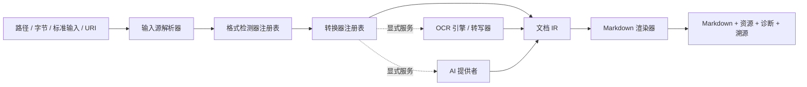

# 架构设计

## 目标

`into-markdown` 是一个可离线运行的 Rust 文档转换平台。所有受支持的格式都会
被规范化为统一的中间表示（IR），再由单一渲染器生成 GitHub Flavored
Markdown。PDF、OCR 和 AI 生成的内容都不能绕过 IR。

系统分为契约层（`core`）、编排层（`engine`）、格式实现（`converters`）、
可选能力提供者（`ocr`、`ai`）、统一渲染器（`render-markdown`）、稳定外观层
（`api`）和应用程序。依赖方向始终朝向 `core`，`core` 不得导入任何具体实现。

## 选择与失败语义

格式检测器生成候选格式，显式格式提示的优先级高于推断结果。转换器按检测与探测
的综合置信度、显式优先级、稳定转换器 ID 依次排序。只有转换器返回
`NotApplicable` 时才允许尝试下一个转换器。一旦转换器返回 `Match`，其转换
结果就是权威结果；格式损坏、加密、资源限制等错误必须直接返回，不能被无关
解析器掩盖。

插件代码通过 `RegistryBuilder` 显式注册。Rust 没有稳定的动态 ABI，因此项目
不支持进程内 Rust 动态库插件。未来为隔离执行和第三方分发预留带版本的进程外
或 WASI 协议。

## IR 与溯源

IR 可表达段落、标题、富文本、嵌套列表、表格、代码、公式、脚注、图片、页面、
幻灯片、工作表和带时间范围的媒体片段。页码、幻灯片、工作表、单元格坐标及
时间戳保存在 `SourceLocator` 中。每个实质内容节点都必须标明来源：原生解析、
本地 OCR、AI 提供者、元数据或确定性后处理。

AI 提供者不能返回无法追踪的整篇重写文档。它只能返回带 AI 溯源信息的新节点，
或带版本的 `DocumentPatch`；引擎验证补丁后才能应用。原始来源节点始终可审计。

## GFM 渲染契约

中央渲染器按 IR 的阅读顺序输出确定性的 GFM，所有换行统一为 LF，并且只在非空
输出末尾保留一个 LF。渲染前会再次验证 Document 和完整资源清单；任何层级中的
图片引用缺失、资源 ID 重复、媒体类型不安全或输出策略无法兑现时都返回稳定的
`internal` 错误，不生成部分结果或伪成功。渲染器不修改转换器已经产生的诊断，
也不重排引擎收集的 provenance。

GFM 没有原生行列合并语法。表格会展开为矩形逻辑网格：内容只出现在 span 的
左上原点，其余覆盖位置为空；原点使用 `data-rowspan` 和 `data-colspan` 的内联
HTML 保留跨度语义。只有首行全部单元格均为表头时才使用 GFM 表头行，其他
`header` 单元格使用 `<strong>` 保留强调。多块单元格以 ` ` 展平。下划线、
上标和下标分别使用 `<u>`、`` 和 ``；代码和公式围栏始终长于内容中
连续反引号。列表的源 marker label 经过百分号编码后放入 HTML 注释，避免丢失。

Document metadata 不进入 Markdown，防止 namespaced properties 意外泄漏；调用方
仍可从结构化 Document 读取它。provenance 和诊断同样只存在于结构化转换结果中。
页面、幻灯片、工作表与时间片段使用可见、稳定的标题或时间标签表达。

渲染器只生成资源引用，不创建目录或写文件。`extract` 使用
`asset_uri_prefix + asset-<SHA-256(asset ID)>.<安全扩展名>`；建议文件名只贡献
最长 16 字节的 ASCII 字母数字扩展名。该纯函数由渲染器和 CLI 写出层共享，结果
长度有界、全 ASCII，且不受路径分隔符、Unicode、大小写折叠与 Windows 保留名影响。
CLI 负责将文件系统目录逐路径段编码为 URI path reference，保留根与 `/` 分隔符，
并编码会形成 query、fragment 或无效转义的字节；渲染器保留其中已经形成的 `%HH`，
避免二次编码。bundle 在渲染前固定使用 `assets` 前缀，其 `document.md` 只引用归档内
条目，不执行额外的外部 extract。
`embed` 只接受有字节且 MIME token 安全的资源并
生成 base64 data URI；`omit` 只保留 alt 文本，但仍验证引用存在。资源落盘、冲突
处理与原子写入属于调用方职责。

源文档链接会拒绝控制字符、任何 HTML character reference、`javascript`、
`vbscript`、`data`、`file` scheme 和含 userinfo 的绝对 URL，再对 Markdown 目标
中的结构字符做百分号编码并把 `&` 输出为 `&amp;`，防止 CommonMark 实体解码改变
已校验的目标。渲染器
生成的受控 data URI 不走源链接策略，因此保留 data URI 必需的分隔符。

## 支持平台

- macOS ARM64
- Linux x86_64
- Linux ARM64
- Windows x86_64

项目明确不支持 macOS x86_64。CPU 推理是跨平台基线；未来可通过独立 Bazel
配置增加可选 GPU Execution Provider，而无需修改 `OcrEngine` 或
`TensorRuntime` 接口。
