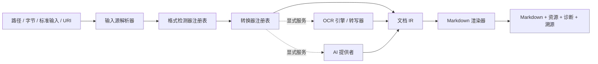

# 架构设计

## 目标

`into-markdown` 是一个可离线运行的 Rust 文档转换平台。所有受支持的格式都会
被规范化为统一的中间表示（IR），再由单一渲染器生成 GitHub Flavored
Markdown。PDF、OCR 和 AI 生成的内容都不能绕过 IR。

系统分为契约层（`core`）、编排层（`engine`）、格式实现（`converters`）、
可选能力提供者（`ocr`、`ai`）、统一渲染器（`render-markdown`）、稳定外观层
（`api`）和应用程序。依赖方向始终朝向 `core`，`core` 不得导入任何具体实现。

## 选择与失败语义

格式检测器生成候选格式，显式格式提示的优先级高于推断结果。转换器按检测与探测
的综合置信度、显式优先级、稳定转换器 ID 依次排序。只有转换器返回
`NotApplicable` 时才允许尝试下一个转换器。一旦转换器返回 `Match`，其转换
结果就是权威结果；格式损坏、加密、资源限制等错误必须直接返回，不能被无关
解析器掩盖。

插件代码通过 `RegistryBuilder` 显式注册。Rust 没有稳定的动态 ABI，因此项目
不支持进程内 Rust 动态库插件。未来为隔离执行和第三方分发预留带版本的进程外
或 WASI 协议。

## IR 与溯源

IR 可表达段落、标题、富文本、嵌套列表、表格、代码、公式、脚注、图片、页面、
幻灯片、工作表和带时间范围的媒体片段。页码、幻灯片、工作表、单元格坐标及
时间戳保存在 `SourceLocator` 中。每个实质内容节点都必须标明来源：原生解析、
本地 OCR、AI 提供者、元数据或确定性后处理。

AI 提供者不能返回无法追踪的整篇重写文档。它只能返回带 AI 溯源信息的新节点，
或带版本的 `DocumentPatch`；引擎验证补丁后才能应用。原始来源节点始终可审计。

## 支持平台

- macOS ARM64
- Linux x86_64
- Linux ARM64
- Windows x86_64

项目明确不支持 macOS x86_64。CPU 推理是跨平台基线；未来可通过独立 Bazel
配置增加可选 GPU Execution Provider，而无需修改 `OcrEngine` 或
`TensorRuntime` 接口。
