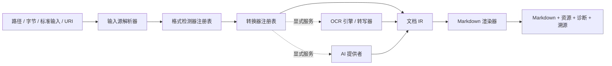

# 架构设计

## 目标

`into-markdown` 是一个可离线运行的 Rust 文档转换平台。所有受支持的格式都会
被规范化为统一的中间表示（IR），再由单一渲染器生成 GitHub Flavored
Markdown。PDF、OCR 和 AI 生成的内容都不能绕过 IR。

系统分为契约层（`core`）、编排层（`engine`）、格式实现（`converters`）、
可选能力提供者（`ocr`、`ai`）、统一渲染器（`render-markdown`）、稳定外观层
（`api`）和应用程序。依赖方向始终朝向 `core`，`core` 不得导入任何具体实现。

每次检测或转换都有独立 `ExecutionContext`。上下文沿所有流水线边和可选服务调用
传播，统一提供阶段进度、协作式取消、总 deadline、显式内存计费与临时空间计费；
这些能力不绑定 Tokio 或其他异步运行时。

## 选择与失败语义

格式检测器生成候选格式，显式格式提示的优先级高于推断结果。转换器按检测与探测
的综合置信度、显式优先级、稳定转换器 ID 依次排序。只有转换器返回
`NotApplicable` 时才允许尝试下一个转换器。一旦转换器返回 `Match`，其转换
结果就是权威结果；格式损坏、加密、资源限制等错误必须直接返回，不能被无关
解析器掩盖。

插件代码通过 `RegistryBuilder` 显式注册。Rust 没有稳定的动态 ABI，因此项目
不支持进程内 Rust 动态库插件。`into-markdown-process-plugin` 提供已版本化的
`process-v1` 进程外运行时；安装与启用层必须先给它经 SHA-256 认证的绝对可执行文件
authority。WASI 使用独立的 `wasi-v1` 边界；第三方 component 由固定版本的真实 WASI Preview 2
运行时隔离执行，默认没有文件、clock、random 或网络权限；安装/注册层必须显式提供
hash、能力和资源限制。协议与威胁边界见 [`wasi-plugins.md`](wasi-plugins.md)。
签名包、全局 publisher trust、项目/全局作用域、原子安装与 CLI dispatch 见
[`plugin-management.md`](plugin-management.md)。

注册表在构建时拒绝空 ID 和同类重复 ID。检测候选与转换尝试的排序键均完整、稳定：
显式格式优先，其后依次比较归一化 confidence、实现 priority 和稳定 ID。探测错误
立即终止；只有 `NotApplicable` 允许继续。匹配后转换失败同样立即返回，转换所得
Document 必须先通过公共 IR 验证，之后才允许进入唯一 Markdown renderer。

## 可恢复任务

Web 调用方可为任务创建本地 `RecoveryStore` 与随机 `RecoveryToken`，再调用
`Engine::convert_recoverable`。任务状态机只有两个可见的已提交状态：`converted`
表示转换器已经产出并验证统一 Document IR，`succeeded` 表示完整 Markdown、资源、
诊断与溯源已经提交。不存在仅凭“开始”或进度事件推断出的成功状态。

每个阶段是带 schema version、任务 token、输入 SHA-256、转换配置 SHA-256、有序
`completedStages`、payload 长度与摘要的不可变文件。固定 4 KiB 元数据尾块使
`RecoveryStore::inspect` 只做常量大小读取和 seek，不读取、分配或反序列化 payload；
完整恢复才按摘要认证 payload。阶段先写入同目录私有随机临时文件并 `fsync`，写入的
每个实际字节同时计入请求 `max_temporary_bytes` 和 2 GiB 硬上限，再以 no-replace
hard link 原子发布并同步目录。崩溃遗留的临时文件不会参与恢复，较新的损坏或未知版本
阶段会 fail closed，而不是降级成旧阶段或成功。

Unix store 在打开后持有目录 handle 和 dev/inode identity。最终 root 只接受当前 euid
所有且 group/other 零权限的目录；已有非私有 root 被拒绝而不会自动改权限，
祖先目录仍可公开。阶段文件、临时文件与任务锁的 open/link/unlink/sync 全部相对该
handle 执行，并在操作边界通过 `fstat` 重验 handle owner/mode、从 namespace 核对
identity；root 权限放宽，或 root/任一祖先被 symlink、rename、mount 替换时均 fail closed。
没有经过审计的相对目录操作的平台返回稳定 `componentUnavailable`，不退回基于路径的
不安全实现。

每次恢复仍重新解析当前输入，并在读取 payload 前比较输入与配置指纹；字节、可信来源
metadata、格式提示或任一 `ConversionOptions` 变化都返回稳定 `recovery` 错误。
`ExecutionOptions` 不进入配置指纹，因此进程重启后可以使用新的取消令牌、deadline 和
进度监听器。每个 token 的持久 advisory lock 将检查、转换与发布线性化；相同指纹的
并发 loser 读取并返回唯一持久 winner，不能返回自己的未提交 payload。`converted`
恢复只重做渲染；`succeeded` 恢复重新校验 Document、诊断、完整资源清单、嵌套图片引用
和 reading-order provenance，并使用当前 renderer 重放后逐字节比较 Markdown。
checkpoint 加载在 typed serde 前执行文件大小、JSON depth、container width 和 value count
预检；depth 上限从公共 `MAX_DOCUMENT_DEPTH` 推导，因此合法最深 IR 的 wire
嵌套也可恢复。资源字节使用带声明解码长度的规范 padded base64 wire，解码前先
校验 alphabet、padding、长度、单资源及总资源请求上限。原始文件、typed wire、base64
字符串、资源向量与解码字节的共存峰值统一计入请求内存预算；文件另受 2 GiB
硬上限。
协议完全离线，不执行任何远程访问。

## IR 与溯源

默认 Engine 由单一核心 catalog 组装。catalog 同时驱动 Rust façade、`formats`、`doctor` 与
发布能力清单，组件条目携带稳定 ID、优先级、`core`/`optional_runtime`/`plugin` 来源边界和
安装提示。重复 ID、非核心来源静态注册、非法优先级、runtime 冒充 available 或 converter 与
格式覆盖漂移都会使 Engine 构建失败。站点插件、媒体、ASR 与 AI provider 不在默认注册表中；
受控 HTTP SourceResolver 仍是核心输入基础且默认离线。

IR 可表达段落、标题、富文本、嵌套列表、表格、代码、公式、脚注、图片、页面、
幻灯片、工作表和带时间范围的媒体片段。页码、幻灯片、工作表、单元格坐标及
时间戳保存在 `SourceLocator` 中。文本来源还可使用原始输入的半开字节范围
`byteStart`/`byteEnd`；字符集解码器不能用解码后的字符位置替代原始 byte offset。
每个实质内容节点都必须标明来源：原生解析、
本地 OCR、AI 提供者、元数据或确定性后处理。

远程格式无法证明响应内生成 HTML 的原始 byte offset 时，不得沿用嵌套 parser 的整份 HTML
locator。MediaWiki 将所有递归 block 标为稳定 MediaWiki provider、清空不可证明 locator，并在
Document metadata 保存唯一 namespaced source record；Engine 的 reading-order provenance inventory
保留相同 provider，从而在不扩展 schema 1 `SourceLocator` 的前提下形成明确关联。
PresentationML 实现位于 converters 层，按 OPC 关系图从 presentation 到 slide，再到可选
layout/master/theme/notes/chart/image 分层解析；它不把 ZIP 视为可任意枚举解压的目录。
converter 只构建 Slide/Heading/Paragraph/List/Table/Image IR，Markdown 必须继续经过中央
renderer。几何继承和 group transform 在 converter 内确定性合成，最终显示 bounds 与 slide
编号写入每个 material node 的 SourceLocator。转换期间的 package/parser/geometry/codec 峰值
在物化前由 request context 预留；返回时同一 reservation 经中央 retained estimator 认证并
收缩为 opaque output lease，typed IR 校验也在独立 working-set preflight 后执行。
旧 Office 兼容层是另一条独立、单向依赖链：`crates/legacy-office` 拥有 runtime authority、
length-prefixed protocol、父进程生命周期、平台 sandbox 与窄 LibreOfficeKit C ABI；
`crates/converters::legacy_office` 只负责 DOC/PPT/XLS probe、调用 worker、nested OOXML dispatch
和 provenance remap。worker 不依赖 converter、engine 或 renderer；converter 不接触 native ABI，
也不能给 worker 传 `Services`。一份源文件对应一个新进程和一个 request/response，终态前必须
kill/wait 或正常 wait，因此 native global state、崩溃与临时 profile 不跨请求复用。
父进程从 no-follow、hash 匹配的 worker/dependency 文件建立请求私有只读 inode tree，再从该
tree 启动；Unix fork/exec 间原子关闭除 0/1/2 外的所有 descriptor。worker 重新验证完整
authority 后，以同样方式复制 kit 与递归依赖闭包，安装 sandbox 后才调用动态加载器，因而路径
rename/swap 与 library constructor 都不能越过已验证 identity。成功协议状态同时要求请求完整写入、
单一响应完整读到 EOF 且 worker 正常退出，任一半关闭或提前响应均 terminate/wait。
Windows 启动器使用显式 `CreateProcessW` attribute list，把三个标准流列为唯一可继承 handle，
在 suspended 状态下先绑定单进程 Job、复核 AppContainer token SID，再恢复主线程；失败路径统一
terminate/wait。AppContainer profile 与 runtime ACL 是平台安装事务的输入，不由请求动态修改。

AI 提供者不能返回无法追踪的整篇重写文档。它只能返回带 AI 溯源信息的新节点，
或带版本的 `DocumentPatch`；引擎验证补丁后才能应用。原始来源节点始终可审计。

## GFM 渲染契约

中央渲染器按 IR 的阅读顺序输出确定性的 GFM，所有换行统一为 LF，并且只在非空
输出末尾保留一个 LF。渲染前会再次验证 Document 和完整资源清单；任何层级中的
图片引用缺失、资源 ID 重复、媒体类型不安全或输出策略无法兑现时都返回稳定的
`internal` 错误，不生成部分结果或伪成功。渲染器不修改转换器已经产生的诊断，
也不重排引擎收集的 provenance。

GFM 没有原生行列合并语法。表格会展开为矩形逻辑网格：内容只出现在 span 的
左上原点，其余覆盖位置为空；原点使用 `data-rowspan` 和 `data-colspan` 的内联
HTML 保留跨度语义。只有首行全部单元格均为表头时才使用 GFM 表头行，其他
`header` 单元格使用 `<strong>` 保留强调。多块单元格以 ` ` 展平。下划线、
上标和下标分别使用 `<u>`、`` 和 ``；代码和公式围栏始终长于内容中
连续反引号。列表的源 marker label 经过百分号编码后放入 HTML 注释，避免丢失。

Document metadata 不进入 Markdown，防止 namespaced properties 意外泄漏；调用方
仍可从结构化 Document 读取它。provenance 和诊断同样只存在于结构化转换结果中。
页面、幻灯片、工作表与时间片段使用可见、稳定的标题或时间标签表达。

渲染前由统一资源规划器冻结 `AssetId -> 物理条目 -> URI` 映射。`extract` 使用
`asset_uri_prefix + asset-<SHA-256(bytes)>.<MIME 权威扩展名>`；完整 256 位摘要进入
文件名，建议文件名不参与路径或扩展名决策。不同 ID 的相同字节与相同规范化 MIME
共享一个物理条目；相同字节却声明不同 MIME 返回稳定的 `assetMetadataConflict`，
摘要键命中后仍比较完整字节，差异返回 `contentHashCollision`。文件名为有界 ASCII，
不受路径分隔符、Unicode 等价形式、大小写折叠、ADS 与 Windows 保留名影响。
CLI 以 Markdown 所在目录（stdout 使用当前工作目录）为基准，对文件系统路径先按
POSIX、Windows drive 或 UNC 语法做词法规范化，再在相同 root/drive/share 内生成
逐段编码的相对 URI；跨 root/drive/share 稳定拒绝，避免把盘符解释为 scheme 或把
UNC server 解释为网络 host。渲染器保留其中已经形成的 `%HH`，避免二次编码。bundle
在渲染前固定使用 `assets` 前缀，其 `document.md` 只引用归档内条目，不执行额外的
外部 extract。
资源 URI 前缀只接受 portable 相对 URI path；拒绝绝对路径、scheme-relative、盘符、
控制字符、query、fragment 以及 `javascript`、`data`、`file` 等 scheme。`embed` 的
data URI 只能由渲染器从已校验 MIME 与字节内部生成。`embed` 只接受有字节且 MIME token 安全的资源并
生成 base64 data URI；`omit` 只保留 alt 文本，但仍验证引用存在。

CLI 把主产物和所有去重后的资源视为一个输出集合：完整预检后，在同一文件系统的
随机 nonce 事务目录写完并 fsync 全部 stage 文件。事务目录包含带签名、版本、root、
严格相对目标清单、内容摘要和递增 generation 的持久 journal；两个 journal 槽交替
写入并分别 fsync，状态转换完成后再同步目录。每个事务登记在 root 下固定、私有的
管理器 registry，并在每个物理目标父目录通过已认证 handle 建立固定名称的 hard-link
lease；lease 绑定父目录 dev/inode、随机 nonce、root 路径及 root 身份，并指向事务内的
受签名标记。父目录身份按稳定顺序取得，缺失目标也保守锁定整个物理父目录；既有目标
另在 journal 绑定 dev/inode。相关输出只读取目标物理父目录的固定 lease，不扫描祖先、
根目录或无关路径；只有 lease、journal、registry、root 身份和排他锁全部匹配时才恢复。
恢复完成后，输出边界在 `ExecutionContext` checkpoint 之间重新执行完整预检；仅内部
`transactionRecoveredRetry` 会触发最多八次重试，超限返回稳定 `recoveryLimit`，不会
写入第三套值或把该内部信号暴露为一次普通命令失败。无关或伪造目录不会被清理。

提交前再次以 no-follow handle 核验每个既有目标为 regular file 且身份未变。Unix
上的所有 rename/link/unlink/fsync 都绑定已认证目录 handle 并使用相对 `*at` 操作；
认证后父目录被换成 symlink 时不会触碰外部目录。Windows 在安全相对目录 handle
操作完成审计前，文件输出事务稳定返回 `componentUnavailable`；路径规划与 bundle
编码仍可使用。
`overwrite` 先把旧文件移入事务备份，再安装 stage；journal 尚未进入 `committed`
时恢复旧集合，进入 `committed` 后验证完整新集合并清理备份。回滚会继续处理其它安全
条目并汇总错误；如果任一恢复操作失败，返回 `rollbackFailed`，保留 journal 与尚存
备份供下一次受限恢复，绝不由临时目录析构删除唯一副本。只有结果已经完整恢复或完成
后，事务目录才会原子移出恢复命名空间再清理。`rename` 与 `error` 不覆盖竞态产生的
文件；跨文件系统、符号链接、目录、FIFO、设备、Windows 输出事务或无法安全
核验的路径在任何目标变更前拒绝。
stdout 是流式边界：外部资源先 stage，stdout 成功（包括既有 EPIPE 成功语义）后才
提交；非 EPIPE 写失败丢弃 stage，已由操作系统接收的 stdout 前缀不能撤回。

源文档链接会拒绝控制字符、任何 HTML character reference、`javascript`、
`vbscript`、`data`、`file` scheme 和含 userinfo 的绝对 URL，再对 Markdown 目标
中的结构字符做百分号编码并把 `&` 输出为 `&amp;`，防止 CommonMark 实体解码改变
已校验的目标。渲染器
生成的受控 data URI 不走源链接策略，因此保留 data URI 必需的分隔符。

## 跨格式语义布局质量边界

转换器输出 Document IR 后，可由独立 `crates/layout-quality` 投影和审计阅读顺序、层级、
page/slide/sheet/cell/part 边界、量化 geometry、table origin-cell 拓扑、资源/脚注引用与完整
来源链。该 crate 只依赖 core，不依赖具体 converter、renderer、模型或远程服务；converter
保留源格式 authority，renderer 只消费已验证 IR，二者都不能用后置修复绕过质量回归。

质量审计复用请求 `ExecutionContext` 的 cancellation、deadline、memory、depth、table 和
work envelope。完整 report 构造成功前不会发布结果；成功 report 持有自己的 request-memory
reservation，失败与 Drop 都释放配额。结构化差异和 IR/GFM hash authority、阈值、fixture
覆盖、平台门禁详见 [`semantic-layout-quality.md`](semantic-layout-quality.md)。

## 支持平台

- macOS ARM64
- Linux x86_64
- Linux ARM64
- Windows x86_64

项目明确不支持 macOS x86_64。CPU 推理是跨平台基线；未来可通过独立 Bazel
配置增加可选 GPU Execution Provider，而无需修改 `OcrEngine` 或
`TensorRuntime` 接口。

固定 CPU 运行层由两部分组成：`crates/ocr` 提供对象安全 `TensorRuntime`、模型契约、
并发 single-flight 和 bounded LRU；`crates/onnxruntime` 负责隔离 worker、受控 ORT C ABI
与真实 CPU session adapter。父进程只验证并持有 runtime 私有副本，不执行 `dlopen`；
worker 在 OS hard memory limit 生效后才加载 ORT 和模型。缓存 key 包含 canonical model identity、模型 SHA-256、
完整 `ModelContract` 的稳定 digest、全部 session options 和经验证的 runtime 版本；每次
查询仍重新校验模型字节与 contract。创建前按 authority 声明的 session 上界预留 count/
bytes，预算直到底层 session 的最后一个 `Arc` 完成析构才释放；因此在途 clone 不会因
LRU eviction 被误算为空闲。加载失败、panic 或取消会同时移除 loading entry 和预留，
不会污染缓存。GPU 仅保留独立构建 feature 名称，默认 CPU artifact 不包含 GPU provider。
张量边界统一限制每侧 64 个名称、256 字节名称和 rank 16；run 预算覆盖输入值/shape
副本、调用槽位、native 最大输出、返回值/shape 副本和 scratch。IPC 使用固定 header、
protocol version、单调 request id 与有界消息/载荷。worker 通过 `ort-sys` API table 先把
IO count 读入标量，名称读入固定 257-byte allocator，rank/dim 读入 `[i64; 16]`，通过检查
后才 fallible 分配 Rust metadata。原生输出同样在 shape/元素/字节契约校验通过后才形成
slice 并分配返回 `Vec`。GraphProto IO 经有界 wire preflight 和 checked-in prost 类型
解析，与 authority/native metadata 三向核对，initializer graph input 按 IR 规则区分为
固定值或 overridable input。

识别实现按单向依赖拆分：model acquisition/精确 TAR 校验负责形成经 `ModelManager` 验证的
组件目录，`ManifestModelResolver` 只从该 install-state 解析模型；recognition authority、
预算、像素插值、batch 预处理和 CTC 各自独立，编排层只组合这些窄接口与 `TensorRuntime`。
识别输出是按 source region 顺序恢复的 `RecognitionResult`，不直接构造 Document IR；OCR
pipeline 在集成边界把结构化结果合入统一 IR，避免模型运行层依赖渲染或文档结构。

该集成边界继续拆为 `merge::{policy,geometry,lines,paragraphs,dedup,provenance,budget}`。
门面消费 Document，在局部完成 source-index 关联、策略、过滤、几何聚类、原生文本去重、
结构化 evidence 与 IR validation 后才一次返回 `ConverterOutput`；任一错误都不会把半成品
写回调用方。公共 IR 以 non-exhaustive `Inline::OcrText` 承载 additive OCR sidecar，避免
扩展 `SourceLocator` 公开 struct 破坏 exact literal consumer。core 的 validation preflight、
retained output estimator、DTO 与 renderer 共同认识该变体，OCR crate 不依赖 engine、DTO
或 renderer 的实现。

## SQLite 任务元数据层

`into-markdown-task-store` 是同步、默认离线的本地元数据边界。它保存 task id、UTC
毫秒时间、状态/百万分比进度、固定标记、allowlist 配置快照、结构化诊断以及外部产物
索引；输入正文、产物正文和 RecoveryStore checkpoint payload 不进入数据库。输入记录只
包含 reference schema、byte count、RecoveryStore 的 canonical input/options fingerprint 与
规范 recovery token，artifact 只包含规范 opaque storage key、类别、byte count 和 SHA-256，
因此 SQLite 不承担无界 blob 或路径/URL 的生命周期。

schema 以 `PRAGMA user_version` 版本化，当前迁移图只有 `0 -> 1`。迁移在单一事务中建表、
索引、外键和 CHECK 约束；重复 open 幂等，遇到大于 1 的版本直接拒绝，不执行 destructive
downgrade。状态修改以 `BEGIN IMMEDIATE` 和 expected-state CAS 完成，进度只能单调增加，
terminal state 没有出边。任务列表按 `(updated_at_ms DESC, id DESC)` 稳定分页。

SQLite 固定使用 `rusqlite 0.37.0` 的 `bundled`、`backup` 与 `limits` features，由
`libsqlite3-sys 0.35.0` 编译 SQLite 3.50.2 amalgamation；不探测或回退到系统 SQLite。
连接强制并回读验证 WAL、foreign keys、`synchronous=FULL`、`trusted_schema=OFF`、
`secure_delete=ON`、`temp_store=MEMORY`、4 KiB page 和 256 MiB page ceiling，并设置 SQLite
allocation limits。每个 `TaskStore` 是可移动但不共享的同步
connection；async 服务必须通过 blocking executor 调用。

启动 reconciliation 分批检查 pending/running/converted task 的 RecoveryStore metadata：
checkpoint token 及 input/options fingerprint 必须常量时间精确匹配后，`succeeded` metadata
确定性提升为 succeeded，`converted` 提升为 converted，无 checkpoint
标为 interrupted；只有明确损坏/不兼容 checkpoint 标为 failed，I/O、安全路径及平台错误传播
且不修改 task。这里的 succeeded 仅表示完整 result checkpoint metadata 已持久化，不代表 Web
artifact 已发布；真正 resume 时 RecoveryStore 才读取并认证完整 payload。该步骤不读取或删除
checkpoint。checkpoint/task retention 与 GC 留给 #52，
排队和调度留给 #47。

在线备份使用 SQLite backup API 写入同一私有 root 的随机临时普通文件，执行 checkpoint、
integrity check、file/directory fsync 后以 hard-link no-replace 发布；不是复制活跃 db/WAL。
目标 SQLite connection 以 `NOFOLLOW` 打开并在写入前后核对临时文件 identity，失败只通过
retained directory handle 删除 identity 未变的临时文件。进程 abort 后可能留下私有随机
临时文件；本层不扫描或自动删除 ownership 无法跨进程证明的 orphan。库不会自动覆盖主库；
恢复必须由操作者在主库关闭后显式授权。
