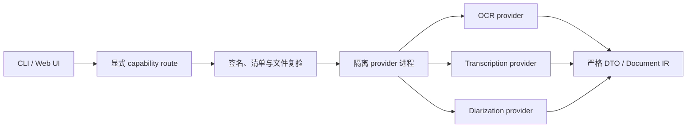

# OCR 与音频能力插件

OCR、语音转写和说话人分离通过独立的 capability provider 提供。宿主只保留类型化
SPI、统一插件管理、确定性路由和隔离进程适配器；官方 PP-OCRv6、Whisper 与
Silero/3D-Speaker 实现位于独立可执行文件中，不在 `into-md` 进程内初始化推理运行时。



## 安装体验

标准发行包自带两个已签名的本地包：

- `official.ocr.ppocrv6.imp`：OCR provider、受审计 ONNX Runtime 与 worker；
- `official.media.whisper.imp`：转写/分离 provider、受审计 FFmpeg、ONNX Runtime 与 worker。

模型不会在转换时自动下载。`into-md setup ocr` 安装并验证官方 OCR 插件和固定模型；
`into-md setup media` 安装并验证官方音频插件、Whisper 与分离模型。完整离线发行包已经
携带模型，因此相同命令只完成本地注册和校验。Web 控制台在 OCR 控件或会议转写控件旁
提供“安装本地组件”，错误也显示在相同区域。

第三方本地包使用显式信任安装：

```sh
into-md plugins install ./vendor.ocr.imp \
  --sha256 <PACKAGE_SHA256> \
  --signing-key-id vendor.example \
  --signing-key-sha256 <PUBLIC_KEY_SHA256> \
  --scope global

into-md plugins verify vendor.ocr --scope global --json
```

本地与 HTTPS 包共用通用插件管理器；HTTPS 必须固定完整包 SHA-256，并继续受无重定向、
默认拒绝私网的传输策略约束。新的发行者公钥指纹必须由调用方显式确认，项目配置只能引用
已经建立的全局信任，不能自行扩大信任。安装完成后，包位于内容寻址目录，签名、目标
平台、完整文件集合、可执行权限、大小和 SHA-256 会在每次加载时重新验证。安装、删除和
信任发布都使用事务日志及崩溃恢复，不存在另一套只服务能力模型的插件生命周期。

## 包与协议

`.imp` 使用与普通插件相同的有界签名 ZIP：

- `plugin.json`：通用安装权威，绑定包 ID/版本、`process-v1`、目标入口、完整文件集合、
  大小、SHA-256、可执行权限和 Ed25519 签名；
- `provider.json`：能力描述，绑定宿主 API 范围、provider/模型身份、媒体与语言范围、
  资源上限和权限；它也包含在 `plugin.json` 的签名文件清单中；
- provider 运行时、经过认证的 helper 与库；模型仍由模型管理器独立安装和校验。

能力分为 `ocr`、`transcription` 和 `diarization`。每项能力独立声明 provider ID、语言、
媒体类型、模型 bundle、最大输入/输出/内存/临时空间和超时。host 与 provider 使用
`process-v1` 长度前缀 JSON 协议；小输入通过 pipe，大输入写入请求私有暂存文件。
OCR 返回输入 SHA-256、尺寸和方向绑定的 DTO，转写与分离返回经过 IR 校验的时间片段，
provider ID 和模型 ID 必须与路由绑定一致。

## 路由与失败语义

配置引用格式为 `plugin-id/capability-id`：

```toml
[capability_routes.ocr]
primary = "official.ocr.ppocrv6/ocr"
fallbacks = []

[capability_routes.transcription]
primary = "official.media.whisper/transcription"
fallbacks = []

[capability_routes.diarization]
primary = "official.media.whisper/diarization"
fallbacks = []
```

`ocr=always` 与 `audio_transcription=only` 要求 primary 就绪，失败时不会改走其它 provider。
自动模式只允许在执行前的 readiness 阶段按配置顺序选择 fallback。开始处理输入后，崩溃、
超时、资源超限或无效结果都会直接失败，不会把同一敏感输入静默交给另一个插件。

## 隔离边界

- 不加载 Rust 动态 ABI；每个能力在单独进程运行。
- 默认无网络、无继承环境、无宿主目录访问；模型根只读，临时目录请求私有。
- child process 权限必须由 `provider.json` 声明；入口和 helper 的执行位必须由
  `plugin.json` 的签名文件权威声明，且实际文件位于已认证 runtime 内。
- macOS 使用 Seatbelt 和父进程物理内存监控，Linux 使用 Landlock、seccomp 与 rlimit，
  Windows 使用预配置的零 capability AppContainer 和 Job Object。
- 路由只在 readiness 失败时切换；结果 DTO、事件顺序、frame、输出字节和进程树生命周期均
  有宿主上限。

发行构建通过通用 `package_plugin` 工具对精确 runtime inventory 签名并生成 `.imp`；
能力包没有旁路打包器。发布私钥只从 CI secret `PLUGIN_SIGNING_KEY_BASE64` 注入，仓库和
产物仅包含公钥记录。归档同时携带 `official-publisher.json`，把官方包文件、包摘要、签名
key ID 与公钥指纹固定下来，`setup` 在注册前重新认证这些值。
