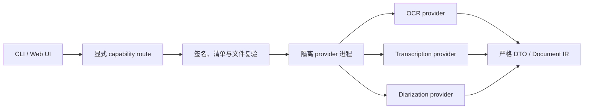

# 自包含能力插件

OCR、语音转写和说话人分离通过独立的 capability provider 提供。Office 97–2003 的
DOC/PPT/XLS 已由 Core 原生解析。宿主只保留类型化
SPI、统一插件管理、确定性路由和隔离进程适配器；官方 PP-OCRv6、Whisper 与
Silero/3D-Speaker 实现位于独立可执行文件中，不在 `into-md` 进程内初始化推理运行时。



## 安装体验

每个平台发布两个独立、已签名的本地包：

- `official.ocr.ppocrv6-<target>.imp`：OCR provider、受审计 ONNX Runtime、worker、模型与字典；
- `official.media.whisper-<target>.imp`：转写/分离 provider、受审计 FFmpeg、ONNX Runtime、worker 与模型。

`<target>` 是 `x86_64-unknown-linux-gnu`、`aarch64-unknown-linux-gnu`、
`x86_64-pc-windows-msvc` 或 `aarch64-apple-darwin`。目标后缀只解决 GitHub Release 的平面资产
命名冲突；下载后的包内 ID、签名 authority 和插件管理命令仍使用不带后缀的稳定插件 ID。

`into-md setup ocr|media` 下载、安装并验证整个能力插件。模型不会在转换时
自动下载，也不是可独立安装、更新或切换的产品对象。Web 控制台在 OCR 控件或会议转写
控件旁提供安装操作，进度和错误显示在相同区域。

第三方本地包使用显式信任安装：

```sh
into-md plugins install ./vendor.ocr.imp \
  --sha256 <PACKAGE_SHA256> \
  --signing-key-id vendor.example \
  --signing-key-sha256 <PUBLIC_KEY_SHA256> \
  --scope global

into-md plugins verify vendor.ocr --scope global --json
```

本地与 HTTPS 包共用通用插件管理器；HTTPS 必须固定完整包 SHA-256，并继续受无重定向、
默认拒绝私网的传输策略约束。新的发行者公钥指纹必须由调用方显式确认，项目配置只能引用
已经建立的全局信任，不能自行扩大信任。安装完成后，包位于内容寻址目录，签名、目标
平台、完整文件集合、可执行权限、大小和 SHA-256 会在每次加载时重新验证。安装、删除和
信任发布都使用事务日志及崩溃恢复，不存在另一套只服务能力模型的插件生命周期。

## 包与协议

`.imp` 使用与普通插件相同的有界签名 ZIP：

- `plugin.json`：通用安装权威，绑定包 ID/版本、`process-v1`、目标入口、完整文件集合、
  大小、SHA-256、可执行权限和 Ed25519 签名；
- `provider.json`：能力描述，绑定宿主 API 范围、provider/模型身份、媒体与语言范围、
  资源上限和权限；它也包含在 `plugin.json` 的签名文件清单中；
- provider 运行时、经过认证的 helper、库、固定模型、字典和许可/SBOM；安装后无需读取
  Core 的共享模型目录即可离线运行。

当前发布能力分为 `ocr`、`transcription` 和 `diarization`。每项能力独立声明
provider ID、语言、媒体类型、最大输入/输出/内存/临时空间和超时。host 与 provider 使用
`process-v1` 长度前缀 JSON 协议；小输入通过 pipe，大输入写入请求私有暂存文件。
OCR 返回输入 SHA-256、尺寸和方向绑定的 DTO，转写与分离返回经过 IR 校验的时间片段，
provider ID 和模型 ID 必须与路由绑定一致。

## 路由与失败语义

能力来源使用同一规范引用：本地来源为 `plugin:ID/CAPABILITY`，远端来源为
`provider:ID/CAPABILITY`。旧的无前缀插件引用只用于兼容读取：

```toml
[capability_routes.ocr]
mode = "prefer"
primary = "provider:bailian/vision-ocr"
fallbacks = ["plugin:official.ocr.ppocrv6/ocr"]

[capability_routes.transcription]
mode = "fallback"
primary = "plugin:official.media.whisper/transcription"
fallbacks = ["provider:bailian/audio-transcription"]

[capability_routes.diarization]
mode = "only"
primary = "plugin:official.media.whisper/diarization"
fallbacks = []
```

`only` 要求 primary 就绪并对执行失败关闭；`fallback` 只允许来源不可用时切换；`prefer`
还允许网络、超时和受控 Provider/OCR 失败按显式顺序恢复。取消、资源超限、内部不变量、
来源身份不匹配和无效结构化结果始终直接失败，绝不把它们伪装成成功。每个候选来源均由
用户配置明确列出，不会发现或调用未列出的 Provider。

远端 OCR 只产生页级 AI 文本，不伪造本地检测框、置信度或模型证据；远端转写必须携带
经过校验的时长、Provider 和模型身份，并生成单调的时间范围。布局、表格、公式和 Markdown
后处理只能返回版本化 Document Patch：未知操作、未知或嵌套目标、冲突替换、悬空资源引用、
重复 ID、越界结构和非精确 AI provenance 在应用前被拒绝，Provider 返回的直接节点不会进入
最终 Document IR。

## 隔离边界

- 不加载 Rust 动态 ABI；每个能力在单独进程运行。
- 默认无网络、无继承环境、无宿主目录访问；插件包根只读，临时目录请求私有。
- child process 权限必须由 `provider.json` 声明；入口和 helper 的执行位必须由
  `plugin.json` 的签名文件权威声明，且实际文件位于已认证 runtime 内。
- macOS 使用 Seatbelt 和父进程物理内存监控，Linux 使用 Landlock、seccomp 与 rlimit，
  Windows 使用预配置的零 capability AppContainer 和 Job Object。
- 路由只在 readiness 失败时切换；结果 DTO、事件顺序、frame、输出字节和进程树生命周期均
  有宿主上限。

发行构建通过通用 `package_plugin` 工具对精确 runtime inventory 签名并生成 `.imp`；
能力包没有旁路打包器。发布私钥只从 CI secret `PLUGIN_SIGNING_KEY_BASE64` 注入，仓库和
产物仅包含公钥记录。Core 携带 `official-publisher.json`，把官方包 HTTPS 地址、包摘要、
签名 key ID 与公钥指纹固定下来，`setup` 在注册前重新认证这些值。两个包分别发布、签名
并生成 SBOM，Core 不包含它们的 runtime 或模型资源。
