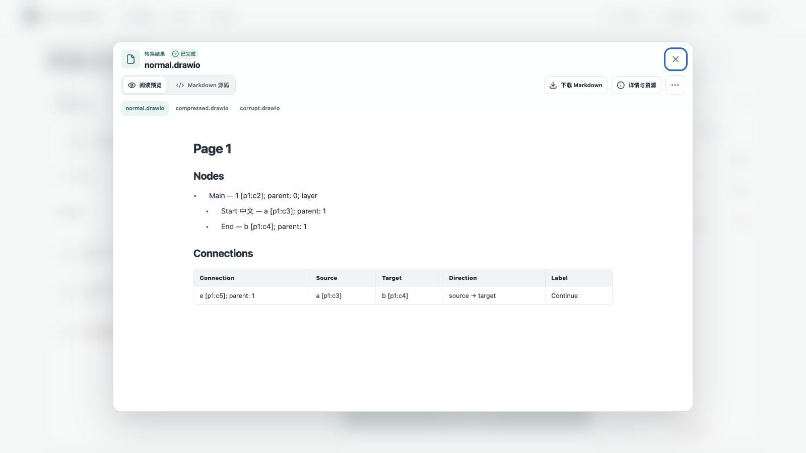
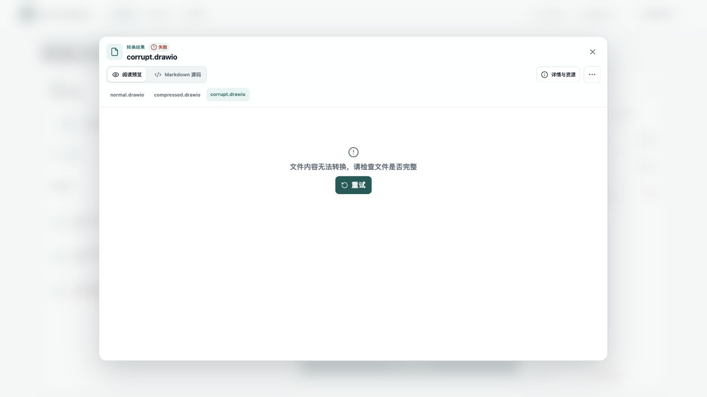

# Issue #330 Drawio 验证记录

实现分支为 `codex/issue-330-drawio`，从主线 `d276d8a` 建立独立 sibling worktree。
生产代码没有新增 Cargo 依赖。抽取流程参考 diagram-design 的
`drawio_extract.py@cc2f51f3fd215536cbfc0cf376ea3b513478e9cb`，MIT 许可、来源审计和安装材料同步。

## 本地证据

| 范围 | 验证与结果 |
| --- | --- |
| 语义模型 | 17 项 Drawio 专项测试通过；压缩/未压缩/裸模型、多页、中文 HTML、包装对象、占位符、深层分组、附加连接标签、ID 与顺序 |
| 缺陷策略 | 重名 ID、失效/歧义引用、父子循环、自由端点、边循环、自连接、多重边、损坏页的 strict/best-effort 矩阵 |
| 安全和资源 | DTD/外部实体拒绝、恶意链接/脚本、超宽属性、超多单元、压缩炸弹、解码截断/尾随字节、精确内存边界、处理中取消和 deadline；失败后 lease 归零 |
| 来源 | 原始 XML 单元的真实字节区间；压缩单元定位原始编码载荷；页/单元序号稳定，附加标签各自保留来源 |
| 转换器回归 | 638 项通过、9 项既有 runtime/性能测试忽略；覆盖普通 XML、HTML、Feed 和 fixture manifest |
| Core | 116 项通过 |
| 公共 API | 61 项通过、2 项既有测试忽略；Drawio 内存/自动检测/显式格式/ZIP/格式冲突另有 3 项集成测试通过 |
| 公共契约 | 16 项通过，格式目录包含 Drawio；Markdown 保留源文本且生成标题 IR |
| CLI | 17 项 exit contract 全部通过，包含 Drawio 文件、中文路径、stdin、批量、显式 XML 及损坏输入 |
| Web | TypeScript 和确定性 dist 校验通过；core 13、workbench 17、preview 4 项通过 |
| 安装和发布契约 | installed-smoke 27 项通过；portable 34、skill 16、platform 72 项 Python 测试通过（platform 的 1 项平台专属测试跳过） |
| 许可 | license-check 94 项及仓库审计通过；候选导出辅助测试默认忽略，显式执行过 |
| 补充回归 | Engine 80、renderer 31、layout-quality 10、OCR 130（1 项忽略、1 项既有 CI 排除）、PDF 质量声明 1 项通过；PR 同组 Python 发布检查 113 项通过 |
| 结构 | 按 `origin/main` 执行 ratchet/check；缩减既有结构债务，不增加阈值或 lint 豁免 |

主要复现命令：

```sh
cargo test --locked -p into-markdown-converters --lib
cargo test --locked -p into-markdown-core --lib
cargo test --locked -p into-markdown --test collecting_parity drawio
cargo test --locked -p into-markdown-cli --test exit_contract
cargo test --locked -p into-markdown-contracts
cargo test --locked -p license-check
cargo test --locked -p installed-smoke
python3 fixtures/generate.py --drawio-only
python3 -m tools.structure_gate check --base-ref origin/main
node web/console/tests/typecheck.mjs
node web/console/build.mjs target/drawio-web-dist --verify web/console/dist
```

Fixture 的正常、压缩、裸模型输出 SHA-256 均为
`e7a22ce8919dc6209d9ccdd222a84d4dd376e58a986f6c2875d82628304bdd2c`。
共享 HTML builder 在构造文本时去重 marks，并复用原有子节点遍历，保证重复粗体标签形成合法 IR。
Web 使用静态受限缩进类保留层级，沿用严格 CSP 和安全预览策略。

## 实际 Web 验收

用当前 worktree 编译的 CLI 启动独立 loopback 服务，在浏览器选择并上传
`normal.drawio`、`compressed.drawio`、`corrupt.drawio`，点击批量转换。
前两项成功，后一项失败并在文件行和对应结果对话框中显示可理解的错误。
正常和压缩结果的节点、ID、父关系、箭头与连接文字一致。
实际 DOM 的图层缩进为 0 px，子节点为 24 px；关系表五列完整显示。
截图只包含仓库自建样本，不含会话凭据。





## 既有回归与证据边界

`collecting_parity::production_large_inputs_have_bounded_native_overhead_and_resources`
原先要求大型 XLSX 的临时存储峰值为零，实测为 286720 字节。
同一命令在干净的主线 `d276d8a` 独立 worktree 中复现了相同失败。
按用户要求，将这组固定样本的上限调整为 1 MiB，直接施加到 native/aggregate
转换预算；每次转换结果释放后仍断言临时资源归零，时间和内存断言保持。
完整 collecting parity 7 项通过，大型 XLSX 的 native/aggregate 均为 286720 字节。
公共契约中两处 Markdown 文本预期同步到现有源文本保留行为，并检查标题 IR，
生产 Markdown 路径保持原样。

扩展执行 PDF layout 的全部 43 项测试时，42 项通过；未改动的
`outside_page_geometry_fails_without_a_publishable_document_or_lease` 失败，
其断言要求页边界外的矩形返回 Malformed。本次仅同步 PDF 质量声明的 manifest/OCR
关联哈希，PDF 几何生产代码与该测试均未修改；对应质量声明专项通过。
该项与 Drawio 验收分开记录。

首次 PR CI 检出了 fixture manifest 的关联哈希缺口。修正后同步 OCR、PDF、语义布局
和非分发测试来源声明，并确认全部既有 fixture 与 OCR goldens 逐项不变。
十二个发布 profile 随测试来源哈希更新，仅 SBOM/SOURCES 的摘要变化，材料大小保持。

#331 报告的原始 20 个 Drawio 文件尚未取得。当前样本均为仓库自建 Apache-2.0 数据，
不代表这些原文件已通过验收。四平台安装产物的实际执行结果与本地契约测试分开记录；
本地 Web 使用工作树调试构建，已发布版本不在这组证据中。

发布门禁的 profile 哈希通过显式运行
`cargo test -p license-check export_release_material_profile_candidate -- --ignored`
生成候选，再逐项核对 catalog、声明和 SBOM 变化后固定。普通审计仍验证固定哈希，
候选导出不会覆盖 authority。`materials.rs` 纳入 renderer authority，覆盖本次抽出的许可集合校验。
